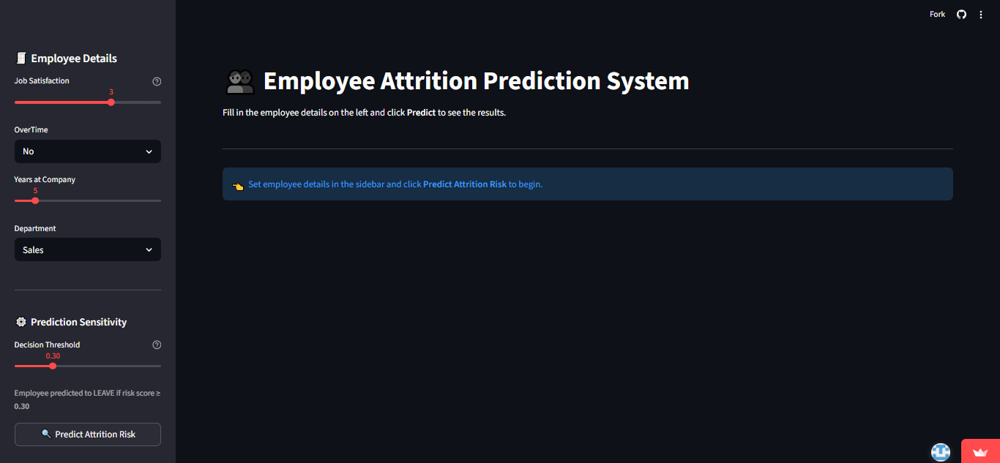
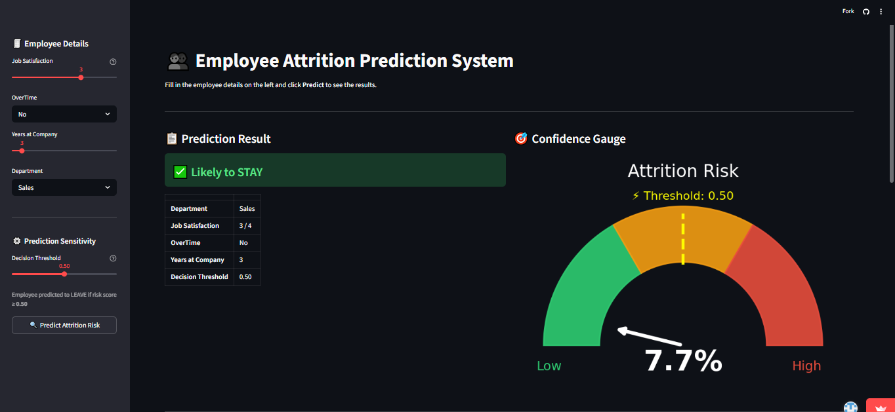

# 🚀 Employee Attrition Prediction System
Python ML Deployment

A production-ready machine learning system for predicting employee turnover (attrition) and uncovering the hidden drivers behind why employees leave. This project integrates statistical feature selection, class imbalance handling, explainable AI (SHAP), and a deployed Streamlit web application.

## 📌 Problem Statement
High employee turnover is a critical challenge for modern organizations due to:

* High costs associated with recruitment, onboarding, and lost productivity.
* Loss of institutional knowledge and decreased team morale.
* The difficulty of identifying "at-risk" employees before they resign.
This project aims to build a proactive, data-driven system that predicts employee attrition and provides actionable insights for HR retention strategies.

## 🎯 Objectives
* Develop robust ML classifiers to predict employee attrition.
* Handle class imbalance to ensure accurate detection of departing employees.
* Identify key drivers of turnover using advanced feature selection (ANOVA/Chi-Square).
* Provide model interpretability using Explainable AI (SHAP).
* Deploy an interactive web interface for HR professionals.

## 🛠️ Tech Stack
* **Language:** Python
* **Libraries:** Pandas, NumPy, Scikit-learn
* **Models:** Logistic Regression, Decision Tree, XGBoost
* **Explainable AI:** SHAP (SHapley Additive exPlanations)
* **Visualization:** Matplotlib, Seaborn
* **Deployment:** Streamlit
* **Environment:** Jupyter Notebook

## 📊 Dataset
* **Source:** IBM HR Analytics Attrition Dataset

**Description:**
* Comprehensive synthetic employee data.
* 1,470 records with 35 features.
* Includes Demographics, Satisfaction Scores, Income, and Tenure.
* **Target:** `Attrition` (0 = No, 1 = Yes)
* **Challenge:** Moderately imbalanced dataset (84% Retention vs. 16% Attrition).

## 📁 Project Structure
```text
employee-attrition-prediction/
│
├── README.md
├── requirements.txt
│
├── app.py                                 # Streamlit web interface
├── WA_Fn-UseC_-HR-Employee-Attrition.csv  # Raw Dataset
│
├── employye.ipynb                         # Core Notebook (EDA, Preprocessing, Modeling)
│
├── models/
│   └── xgb_model.pkl                      # Saved XGBoost model
│
└── images/
    ├── chi2_scores.png
    ├── anova_scores.png
    └── confusion_matrices.png
```
## ⚙️ Model & Methodology

### 🔹 Preprocessing
* Data cleaning and dropping redundant columns (e.g., `EmployeeCount`).
* Categorical encoding using `LabelEncoder`.
* Feature scaling using `MinMaxScaler`.
* **Feature Selection:** Extracted the top 15 most critical features combining **Chi-Square** and **ANOVA F-tests**.

### 🧠 Model Comparison

| Model | Type | Imbalance Strategy |
| :--- | :--- | :--- |
| **Logistic Regression** | Interpretable baseline | `class_weight='balanced'` |
| **Decision Tree** | Rule-based baseline | `class_weight='balanced'` |
| **XGBoost ⭐** | Gradient boosting | `scale_pos_weight` |

### 🔹 Training
* Pipeline-based training and evaluation.
* Addressed the 84:16 class imbalance natively within model algorithms to heavily penalize missed attrition predictions.

### 🔹 Evaluation
* Accuracy
* Precision
* Recall
* F1-Score
* Confusion Matrix
* SHAP Values (Interpretability)

🚨 **Focus on F1-Score and Recall** to minimize undetected "at-risk" employees.

---

## 📈 Results
* **XGBoost** outperformed baseline models, achieving an **84% accuracy** and providing the best **F1-Score (0.47)** for the minority class.
* **Key HR Insights via SHAP:** * **Overtime** is the strongest predictor of an employee leaving.
  * Lower **Job Level** and **Monthly Income** severely increase attrition risk.
  * New hires (fewer years at the company) exhibit the highest turnover rates.

---

## 🌐 Web Application
An interactive Streamlit app is included for real-time risk assessment by HR managers.

✨ **Features**
* User-friendly employee metric input (Sliders & Dropdowns).
* Instant attrition risk prediction (Yes/No).
* Clean and responsive UI.

👉 **Try it here:**
[Employee Attrition Prediction App] (https://employee-attrition-prediction-using-hr-analytics-rgymioa78pgmk.streamlit.app/)

## 📸 App Preview
### 🔹 Main Interface


### 🔹 Prediction Demo


## 💻 How to Run Locally

**1. Clone Repository**
```bash
git clone https://github.com/athulyamannambath/Employee-Attrition-Prediction-Using-HR-Analytics.git
cd Employee-Attrition-Prediction-Using-HR-Analytics
```
**2. Install Dependencies**
```bash
pip install -r requirements.txt
```
**3. Run the App**
```bash
streamlit run app.py
```
